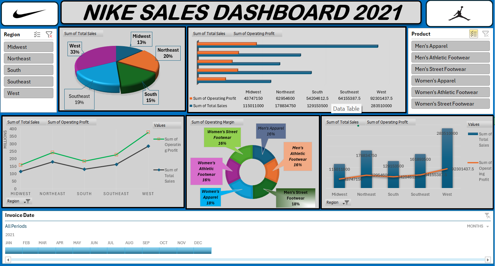

## NIKE SALES DASHBOARD — 2021 (Excel)
📊 Interactive Nike Sales Dashboard (2021) — Built in Excel to visualize regional &amp; product performance.  Includes data cleaning workflow, KPIs, and actionable insights

> **Objective:** Build an interactive Excel dashboard to analyze 2021 Nike sales and operating profit by **Region** and **Product Category**, enabling quick, data‑driven decisions with slicers and a timeline.

---

## 🧰 Tools & Skills
- **Microsoft Excel**: PivotTables, PivotCharts, Slicers, Timeline
- **(Optional) Power Query**: Data cleaning & shaping
- **Formulas**: `TRIM`, `CLEAN`, `UPPER/PROPER`, `IFERROR`, `TEXT`, `ROUNDUP`
- **KPIs Tracked**: Total Sales, Operating Profit, Operating Margin (%)

---

## 🧽 Data Cleaning — Step by Step

1. **Import & Inspect**
   - Load raw file(s) → check column names, data types, blanks, and duplicates.
2. **Standardize Text**
   - Remove extra spaces: `=TRIM(A2)`  
   - Consistent casing: `=PROPER(A2)` or `=UPPER(A2)`
3. **Fix Data Types**
   - Convert **Invoice Date** to Date type.  
   - Ensure **Sales/Profit** columns are **Number/Currency**.
4. **Handle Nulls/Errors**
   - Replace blanks with 0 or “Unknown” as appropriate.  
   - Wrap computations with `IFERROR(value, 0)`.
5. **Create Helper Columns**
   - **Month**: `=TEXT([@InvoiceDate], "MMM")`  
   - **Quarter**: `="Q"&ROUNDUP(MONTH([@InvoiceDate])/3,0)`  
   - **Operating Margin %**: `=[@Operating Profit]/[@Total Sales]`
6. **Remove Duplicates**
   - Use **Data → Remove Duplicates** on unique keys (e.g., Invoice No + Line ID).
7. **Load to Model**
   - Build **PivotTables** for Regions, Products, and Time; add **Slicers** + **Timeline**.

---

## 📈 Dashboard Highlights
- **Filters**: Region, Product Category, and 2021 Timeline (Jan–Dec).  
- **Visuals Used**:  
  - Regional **Sales Share (Pie)**  
  - **Sales vs Operating Profit** by Region (Bars + Line)  
  - **Operating Margin by Product** (Donut)  
  - Trend comparison by Region (Lines)

---

## 🔎 📊 Key Insights (from 2021 view)

- **West** region achieved the highest sales (**$28.35M**)  
- **Northeast** recorded the highest profit (**$6.29M**) with strong margins  
- **Midwest** had the lowest sales (**$11.50M**) and profit (**$4.37M**)  
- **Women’s Street Footwear**, **Men’s Street Footwear**, and **Women’s Apparel** show the strongest margins (**18%**)  
- Sales & profit peaked in **August**; lowest activity observed in **December**  

---

## 📌 KPIs
- **Total Sales:** $91.5M+  
- **Highest Sales Region:** West ($28.35M)  
- **Highest Profit Region:** Northeast ($6.29M)  
- **Lowest Sales & Profit Region:** Midwest ($11.50M / $4.37M)  
- **Peak Month:** August  
- **Top Margin Categories:** Women’s Apparel & Men’s Street Footwear (18%)
- 
## 💡 Opportunities & Recommendations
- 📍 **Boost marketing** in Midwest to improve low sales & profit.  
- 👟 Focus on **promoting Athletic Footwear** categories for better margins.  
- 📈 **Replicate Northeast’s sales-to-profit efficiency** strategy across other regions.  
- 🎯 Explore **festive season offers in Q4** to avoid year-end decline.
---

> *Note: “M” denotes millions in the underlying dataset.*

---

### 🙌 Credits
**Author : Shahhid Ali**

Data modeled and visualized in **Microsoft Excel**.
